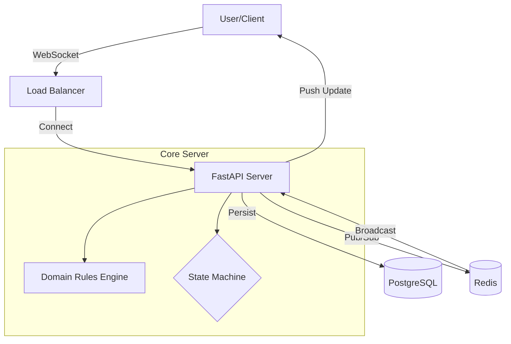

# 00. Architecture Index & Documentation Map

## 1. Purpose
This document serves as the master entry point for the Real-Time Collaborative Football Tactical Canvas documentation. It ensures navigability, traceability, and structural integrity of the project's knowledge base.

## 2. Documentation Map (Reading Order)

| Sequence | ID | Document Title | Purpose |
| :--- | :--- | :--- | :--- |
| **00** | **INDEX** | **Architecture Index** | You are here. Map and version history. |
| **01** | **BRD** | [Business Requirements](01-BRD.md) | High-level goals, features, and success metrics. |
| **02** | **FRS** | [Functional Specs](02-FRS.md) | Detailed behavior, rules, and user interaction logic. |
| **03** | **WS** | [WebSocket Protocol](03-WebSocket-Protocol-Spec.md) | API contract for real-time events. |
| **04** | **API** | [REST API Spec](04-REST-API-Spec.md) | API contract for HTTP resources. |
| **05** | **B-TDD** | [Backend TDD](05-Backend-TDD.md) | Server-side implementation plan and architecture. |
| **06** | **F-TDD** | [Frontend TDD](06-Frontend-TDD.md) | Client-side implementation plan and state management. |
| **07** | **QA** | [Test Plan](07-Test-Plan-QA-Strategy.md) | QA strategy, test cases, and coverage goals. |
| **08** | **RTM** | [Traceability Matrix](08-Requirements-Traceability-Matrix.md) | Linkage between BRD -> FRS -> Tests. |
| **09** | **STATE** | [State Machines](09-State-Machines.md) | Formal logic for Room, Lock, and Match lifecycles. |
| **10** | **DB** | [Database Spec](10-Database-Schema-Spec.md) | Schema, constraints, indices, and migration. |
| **11** | **NFR** | [NFRs](11-Non-Functional-Requirements.md) | Performance, Scaling, Reliability limits. |
| **12** | **OPS** | [Deployment Plan](12-Deployment-Plan.md) | Docker, Redis, and DevOps procedures. |
| **13** | **RISK** | [Risk Register](13-Risk-Register.md) | Known risks and mitigation strategies. |
| **14** | **VER** | [Change Management](14-Change-Management.md) | Versioning and deprecation policies. |

## 3. System Overview

## 4. Version History

| Version | Date | Author | Changes |
| :--- | :--- | :--- | :--- |
| v1.0 | 2026-02-14 | Architecture Team | Initial Restructuring and Index creation. |
