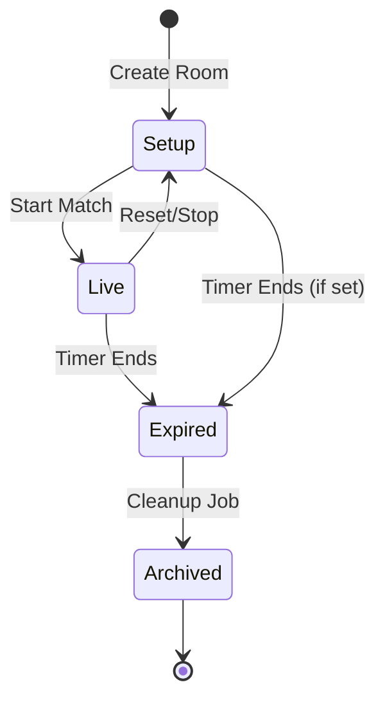
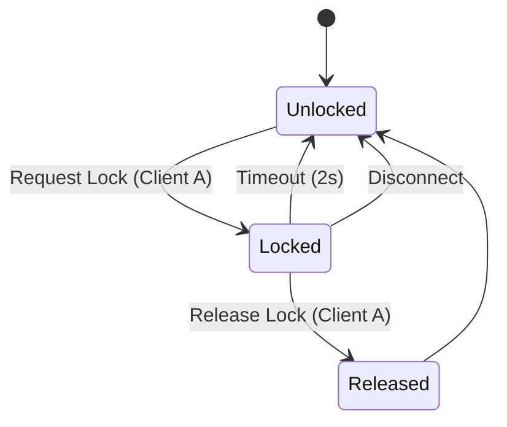

# 09. State Machines

## 1. Room Lifecycle State Machine (SM-ROOM-01)

Defines the high-level status of a game session.



| State | Description | Transitions |
| :--- | :--- | :--- |
| `Setup` | Initial state. Configuration allowed (Teams, Colors). | `Start Match` -> `Live` |
| `Live` | Match in progress. Config locked. Role locked. | `Timer Ends` -> `Expired` |
| `Expired` | Read-only mode. No mutations allowed. | `Cleanup` -> `Archived` |
| `Archived` | Serialized to cold storage. | |

## 2. Lock State Machine (Optimistic Locking) (SM-LOCK-01)

Used for handling concurrent drag operations on players.



| State | Description | Owner |
| :--- | :--- | :--- |
| `Unlocked` | Entity is free to be moved. | None |
| `Locked` | Entity is being dragged. Rejected for others. | Client_ID |
| `released` | Transient state during update commit. | System |

## 3. Match Lifecycle Transitions (SM-MATCH-01)

Flow of a typical match session:

1.  **Initialization**: Coach creates room. State: `setup`.
2.  **Preparation**:
    *   Teams renamed.
    *   Colors chosen.
    *   Players added to bench.
3.  **Kick-off**: Coach clicks "Start Match".
    *   State -> `live`.
    *   Locks config edits.
4.  **Gameplay**:
    *   Movements occur.
    *   Autosaves trigger.
5.  **Conclusion**:
    *   Timer hits 90:00.
    *   State -> `expired`.
    *   WS broadcasts "Game Over".

## 4. Reconnect Flow (SM-CONN-01)

```mermaid
sequenceDiagram
    participant Client
    participant Server
    participant Redis

    Client->>Server: Connect (WS)
    Server->>Redis: Get Room State
    Redis-->>Server: State JSON
    Server->>Client: Send INIT_STATE (Snapshot)
    
    rect rgb(200, 255, 200)
    Note over Client, Server: Replay Buffer
    Server->>Client: Send Missed Events (since Snapshot)
    end

---

# 5. Cross-References

*   **Implemented By**: [03-WebSocket-Protocol-Spec.md](03-WebSocket-Protocol-Spec.md), [05-Backend-TDD.md](05-Backend-TDD.md).
*   **Requirements Source**: [02-FRS.md](02-FRS.md).

```
