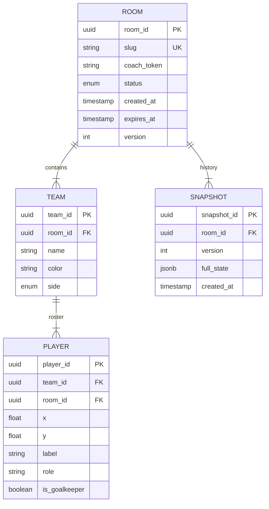

# 10. Database Schema Specification

## 1. Overview
This document defines the persistence layer for the Real-Time Collaborative Football Tactical Canvas. The system uses **PostgreSQL** for persistent storage and **Redis** for ephemeral state and caching.

## 2. ER Diagram (Mermaid)

## 3. Review of Table Constraints

### 3.1 Rooms Table
| Column | Type | Constraint | Description |
| :--- | :--- | :--- | :--- |
| `room_id` | UUID | PRIMARY KEY | Unique identifier (v4) |
| `slug` | VARCHAR(64) | UNIQUE, INDEX | Human-readable URL slug |
| `status` | VARCHAR(20) | NOT NULL | `setup`, `live`, `expired`, `archived` |
| `version` | INTEGER | DEFAULT 0 | Optimistic concurrency control |
| `expires_at` | TIMESTAMP | INDEX | For TTL cleanup jobs |

### 3.2 Teams Table
| Column | Type | Constraint | Description |
| :--- | :--- | :--- | :--- |
| `team_id` | UUID | PRIMARY KEY | Unique identifier |
| `room_id` | UUID | FOREIGN KEY | On Delete Cascade |
| `side` | VARCHAR(10) | NOT NULL | `home` or `away` |

**Constraints:**
*   Unique `(room_id, side)`: One home and one away team per room.

### 3.3 Players Table
| Column | Type | Constraint | Description |
| :--- | :--- | :--- | :--- |
| `player_id` | UUID | PRIMARY KEY | Unique identifier |
| `team_id` | UUID | FOREIGN KEY | On Delete Cascade |
| `x` | FLOAT | CHECK (0-1) | Normalized coordinate |
| `y` | FLOAT | CHECK (0-1) | Normalized coordinate |

**Constraints:**
*   Unique `(player_id, room_id)`: Prevent ID collision.
*   Limit ~15 players per team (Application level enforcement preferred, or trigger).
*   **Safety Check**: `CHECK (x >= 0.0 AND x <= 1.0 AND y >= 0.0 AND y <= 1.0)` enforced at DB level.

## 4. Migration Strategy

### 4.1 Tooling
*   **Alembic** for schema migrations.
*   Version controlled migration scripts in `migrations/versions/`.

### 4.2 Policies
*   **Forward-Only**: Rollbacks are tested but production moves forward.
*   **Non-Blocking**: structural changes (ADD COLUMN) prefer nullable or default values to avoid table locks.
*   **Version Pinning**: Application startup checks implementation version vs database schema version.

## 5. Persistence & WAL Configuration
*   **WAL Mode**: Write-Ahead Logging enabled for reliability.
*   **Sync Commit**: `off` for performance (if acceptable data loss < 1s), or `on` for strict durability. MVP: `on`.
*   **Checkpoint**: Adjusted for write-heavy workload (autosaves).

## 6. Archival Strategy

*   **Soft Delete**: `deleted_at` column on `rooms` table.
    *   Formations preserved during soft delete.
*   **Hard Delete**: background job purges rooms with `deleted_at < NOW() - 7 days`.
    *   **Cascade Policy**:
        *   `ON DELETE CASCADE` for Formations.
        *   `ON DELETE CASCADE` for Snapshots.
        *   `ON DELETE CASCADE` for Players/Teams.

---

# 7. Cross-References

*   **API Usage**: [04-REST-API-Spec.md](04-REST-API-Spec.md).
*   **Operational Context**: [12-Deployment-Plan.md](12-Deployment-Plan.md), [14-Change-Management.md](14-Change-Management.md).

